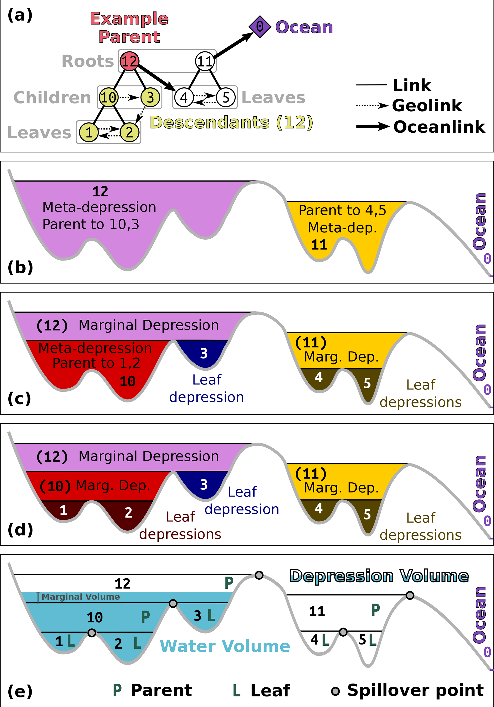
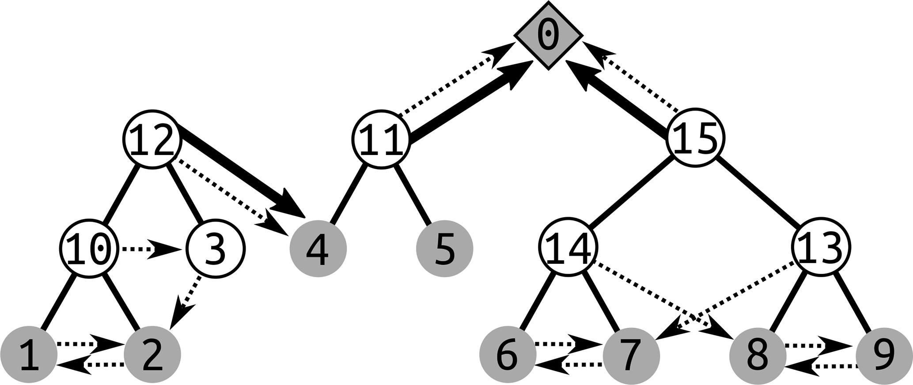
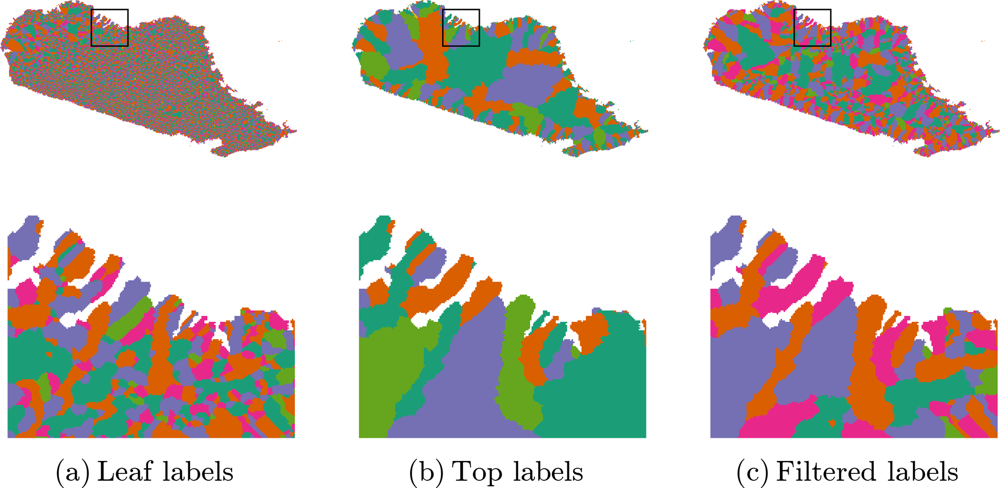

## DESCRIPTION

***r.richdem.dephier*** computes the depression hierarchy of a digital elevation model (DEM) and stores the results in two raster maps and one vector map. The depression hierarchy is a data structure that encodes all nested depressions in a landscape and their hydrological connectivity, without removing them by filling or breaching.

This module is the required first step of the Fill--Spill--Merge workflow (Barnes et al., 2020, 2021). Its outputs feed directly into *[r.richdem.fsm](r.richdem.fsm.md)*.

### Depression hierarchy concept

Every topographic depression, from a small pit cell to a large endorheic basin, can be described as part of a hierarchy. Small *leaf depressions* contain no sub-depressions. When a leaf depression fills to its pour point (lowest outlet), water spills into an adjacent depression; the two merge into a *meta-depression* that itself can fill and spill into its neighbor. This nesting continues until water eventually reaches the ocean (or the map boundary, treated as the ultimate outlet).

The hierarchy is stored as a forest of binary trees: each node represents a depression (leaf or meta), and the two children of any meta-depression are the two depressions that merged to form it. Separately, ocean links record depressions that drain directly to the ocean rather than to another depression.


*Depression hierarchy terminology. (a) Binary tree relating leaf and meta depressions. (b--d) Cross-sections illustrating nested leaf, marginal, and meta depressions. (e) Volume--elevation relationship with Parent, Leaf, and Spillover components. Figure 2 from Barnes, Callaghan & Wickert (2021), CC-BY 4.0.*


*A forest of binary trees representing the depression hierarchy of a landscape. Solid lines connect parent meta-depressions to their two child depressions; dashed arrows show geolinks (overflow connections between adjacent depressions) and ocean links. Each numbered node corresponds to a leaf or meta depression label stored in **output_labels** and **output_hierarchy**. Figure 1 from Barnes, Callaghan & Wickert (2020), CC-BY 4.0.*

### Output rasters

**output_labels** assigns each cell its leaf-depression label---an integer identifying which leaf depression it is part of. Cells that drain directly to the ocean receive label 0 (OCEAN).

**output_flowdirs** contains a D8 flow direction for each cell. Directions are encoded as integers 0--7 counting counter-clockwise from east (matching the RichDEM convention). Pit cells, which have no outflow direction, are stored with value 8.

### Output vector map (two-layer)

**output_hierarchy** is a two-layer GRASS vector map whose attribute database holds the complete depression hierarchy:

**Layer 1 --- depressions table** contains one feature per depression. Leaf depressions are represented as area polygons (derived from the labels raster). Meta-depressions are represented as points located at the saddle cell (*out_cell*) where their two child depressions merge. Attribute columns include:

**dep_label**
:   Unique integer label for the depression

**type**
:   *leaf* or *meta*

**pit_cell**
:   Flat-index of the lowest cell (pit) in the depression

**out_cell**
:   Flat-index of the pour-point cell (lowest outlet)

**parent**
:   Label of the parent meta-depression (NULL if directly ocean-linked)

**lchild, rchild**
:   Labels of the two child depressions (NULL for leaves)

**odep**
:   Label of the depression this one overflows into via its geolink

**geolink**
:   Label of the depression on the other side of the pour point

**pit_elev**
:   Elevation of the pit cell

**out_elev**
:   Elevation of the pour-point cell

**ocean_parent**
:   1 if this depression drains directly to the ocean, 0 otherwise

**cell_count**
:   Number of cells in the depression

**dep_vol**
:   Depression volume (integrated depth below the pour point)

**water_vol**
:   Volume of water currently in the depression (updated by r.richdem.fsm)

**total_elevation**
:   Sum of elevations of all cells in the depression

**Layer 2 --- ocean_links table** is a junction table with one row per direct ocean connection. Some depressions drain to the ocean through multiple independent pathways; this table records each (dep_label, linked_label) pair. Columns: *cat*, *dep_label*, *linked_label*.


*Example **output_labels** outputs for a DEM of northern Madagascar. (a) Leaf-depression labels: each distinct color is a separate leaf depression. (b) Top-level (root) depression labels: only the largest containing hierarchy level is shown. (c) Filtered labels retaining only depressions above a minimum area threshold. Figure 9 from Barnes, Callaghan & Wickert (2020), CC-BY 4.0.*

## NOTES

The depression hierarchy algorithm runs in O(N) time, where N is the total number of cells, making it suitable for very large DEMs (Barnes et al., 2020).

The input DEM does not need to be pre-conditioned (filled or breached); the algorithm handles all depressions, including nested ones. Raw DEMs with noise may produce a large number of very small leaf depressions.

The output labels raster stores uint32 values internally but is written to GRASS as a DCELL (double-precision float) map because GRASS has no native unsigned 32-bit integer raster type. All label values up to 2<sup>32</sup> − 2 are representable exactly as doubles.

## REQUIREMENTS

This module requires the [RichDEM](https://github.com/r-barnes/richdem) Python package, which is not a standard GRASS GIS dependency and must be installed separately:

```bash
pip install richdem
```

If `pip install richdem` fails (the package requires a C++ compiler), build from source:

```bash
git clone https://github.com/r-barnes/richdem.git
cd richdem/wrappers/pyrichdem
pip install -e .
```

Ensure that RichDEM is installed into the same Python environment used by GRASS GIS.

## EXAMPLES

Compute the depression hierarchy:

```bash
r.richdem.dephier input=dem \
    output_labels=dep_labels \
    output_flowdirs=dep_flowdirs \
    output_hierarchy=dep_hierarchy
```

Inspect the hierarchy table:

```bash
v.db.select map=dep_hierarchy layer=1 | head -20
```

Display leaf depression areas colored by depression volume:

```bash
# Select only leaf depressions
v.extract input=dep_hierarchy layer=1 where="type='leaf'" output=leaf_deps
v.colors map=leaf_deps use=attr column=dep_vol color=blues
```

Use the output to run Fill--Spill--Merge:

```bash
r.richdem.fsm input=dem \
    labels=dep_labels \
    flowdirs=dep_flowdirs \
    hierarchy=dep_hierarchy \
    water_depth=wtd \
    output=wtd_after
```

## REFERENCES

- Barnes, R., Callaghan, K.L., Wickert, A.D. (2020). Computing water flow through complex landscapes -- Part 2: Finding hierarchies in depressions and morphological segmentations. *Earth Surface Dynamics* Vol 8(2), pp 431--445. DOI: [10.5194/esurf-8-431-2020](https://doi.org/10.5194/esurf-8-431-2020)
- Barnes, R., Callaghan, K.L., Wickert, A.D. (2021). Computing water flow through complex landscapes -- Part 3: Fill--Spill--Merge: flow routing in depression hierarchies. *Earth Surface Dynamics* Vol 9(1), pp 105--121. DOI: [10.5194/esurf-9-105-2021](https://doi.org/10.5194/esurf-9-105-2021)
- Barnes, R. (2016). RichDEM: Terrain Analysis Software. URL: <http://github.com/r-barnes/richdem>

## SEE ALSO

*[r.richdem.fsm](r.richdem.fsm.md), [r.richdem.filldepressions](r.richdem.filldepressions.md), [r.richdem.flowaccumulation](r.richdem.flowaccumulation.md), [r.watershed](https://grass.osgeo.org/grass-stable/manuals/r.watershed.html), [r.stream.extract](https://grass.osgeo.org/grass-stable/manuals/r.stream.extract.html)*

## AUTHORS

Richard Barnes, Kerry L. Callaghan, Andrew D. Wickert (Barnes et al., 2020)

GRASS GIS bindings: Andrew D. Wickert, with assistance from Claude Sonnet 4.6
