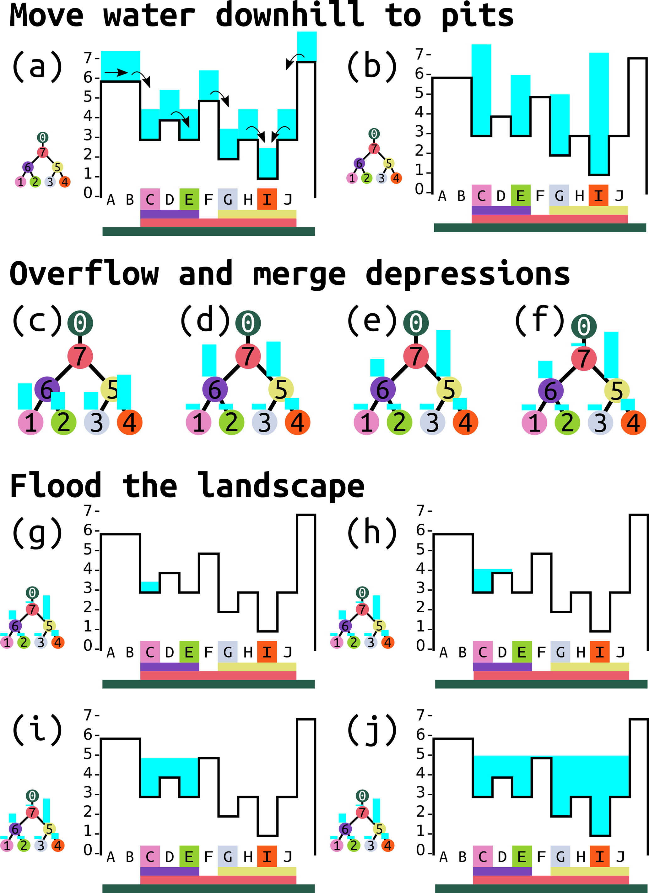

## DESCRIPTION

***r.richdem.fsm*** applies the Fill--Spill--Merge algorithm (Barnes et al., 2021) to redistribute surface water across a landscape, respecting the topographic depression hierarchy computed by *[r.richdem.dephier](r.richdem.dephier.md)*. Unlike conventional flow-accumulation approaches that require depressions to be pre-filled, Fill--Spill--Merge retains real depressions and routes water through them explicitly.

The algorithm operates in three stages:

1. **Downslope routing** --- surface water (positive water-table depth values) is routed downslope to pit cells using the precomputed flow directions, accumulating in the bottoms of depressions.
2. **Hierarchy traversal** --- the depression hierarchy is traversed depth-first. When a depression fills to its pour-point elevation, excess water spills into the adjacent depression identified by the geolink. If both depressions are full they merge into their parent meta-depression, and water is redistributed across the combined volume. This continues until all water is accounted for or reaches the ocean.
3. **Water surface mapping** --- the equilibrium water surface elevation in each depression is computed from the total water volume and the depression's hypsometry, then written back to the output raster as water-table depth.


*The three stages of the Fill--Spill--Merge algorithm illustrated on a synthetic landscape. (a--b) Downslope routing moves surface water to pit cells. (c--f) Hierarchy traversal: depressions fill, overflow at pour points, and merge into meta-depressions. (g--j) Water surface mapping back-calculates the equilibrium water-table depth in each depression from the accumulated volume. Figure 4 from Barnes, Callaghan & Wickert (2021), CC-BY 4.0.*

### Water table depth convention

The **water_depth** and **output** maps use a signed depth convention:

- Values \< 0: water table is below the land surface by that magnitude (e.g., −0.5 means 0.5 m below surface).
- Value = 0: water table is exactly at the land surface (saturated).
- Values \> 0: standing surface water of that depth above the land surface (the cell is inundated).

### Equilibrium solution

Fill--Spill--Merge produces an equilibrium (steady-state) solution for a given water input. The result is path-independent: applying a uniform water depth all at once gives the same equilibrium as applying it incrementally. Multiple time steps are therefore only needed when water inputs or topography change between steps.

## NOTES

All three raster inputs (**input**, **labels**, **flowdirs**) and the vector **hierarchy** must have been produced by *[r.richdem.dephier](r.richdem.dephier.md)* from the same DEM without any modification to the DEM or computational region in between.

In addition to writing the output raster, this module updates the **water_vol** column of the depression hierarchy vector map's attribute table to reflect the volume of water in each depression after redistribution. This keeps the hierarchy consistent with the output raster for subsequent analysis or additional FSM steps.

Fill--Spill--Merge runs approximately 90--2600× faster than iterative (Jacobi-style) approaches because it solves the redistribution problem algebraically using the hierarchy structure rather than by iterative relaxation (Barnes et al., 2021).

## REQUIREMENTS

This module requires the [RichDEM](https://github.com/r-barnes/richdem) Python package, which is not a standard GRASS GIS dependency and must be installed separately:

```bash
pip install richdem
```

If `pip install richdem` fails (the package requires a C++ compiler), build from source:

```bash
git clone https://github.com/r-barnes/richdem.git
cd richdem/wrappers/pyrichdem
pip install -e .
```

Ensure that RichDEM is installed into the same Python environment used by GRASS GIS.

## EXAMPLES

Full Fill--Spill--Merge workflow starting from a raw DEM:

```bash
# Step 1: build the depression hierarchy
r.richdem.dephier input=dem \
    output_labels=dep_labels \
    output_flowdirs=dep_flowdirs \
    output_hierarchy=dep_hierarchy

# Step 2: create an initial water table depth map
# (here: uniformly 0.5 m below the surface)
r.mapcalc "wtd_initial = -0.5"

# Step 3: run Fill-Spill-Merge
r.richdem.fsm input=dem \
    labels=dep_labels \
    flowdirs=dep_flowdirs \
    hierarchy=dep_hierarchy \
    water_depth=wtd_initial \
    output=wtd_after
```

Inspect where surface water accumulated after redistribution:

```bash
r.mapcalc "surface_water = if(wtd_after > 0, wtd_after, null())"
r.colors map=surface_water color=water
```

Check updated water volumes in each depression:

```bash
v.db.select map=dep_hierarchy layer=1 columns=dep_label,water_vol where="water_vol > 0"
```

## REFERENCES

- Barnes, R., Callaghan, K.L., Wickert, A.D. (2021). Computing water flow through complex landscapes -- Part 3: Fill--Spill--Merge: flow routing in depression hierarchies. *Earth Surface Dynamics* Vol 9(1), pp 105--121. DOI: [10.5194/esurf-9-105-2021](https://doi.org/10.5194/esurf-9-105-2021)
- Barnes, R., Callaghan, K.L., Wickert, A.D. (2020). Computing water flow through complex landscapes -- Part 2: Finding hierarchies in depressions and morphological segmentations. *Earth Surface Dynamics* Vol 8(2), pp 431--445. DOI: [10.5194/esurf-8-431-2020](https://doi.org/10.5194/esurf-8-431-2020)
- Barnes, R. (2016). RichDEM: Terrain Analysis Software. URL: <http://github.com/r-barnes/richdem>

## SEE ALSO

*[r.richdem.dephier](r.richdem.dephier.md), [r.richdem.filldepressions](r.richdem.filldepressions.md), [r.richdem.flowaccumulation](r.richdem.flowaccumulation.md), [r.watershed](https://grass.osgeo.org/grass-stable/manuals/r.watershed.html), [r.lake](https://grass.osgeo.org/grass-stable/manuals/r.lake.html)*

## AUTHORS

Richard Barnes, Kerry L. Callaghan, Andrew D. Wickert (Barnes et al., 2021)

GRASS GIS bindings: Andrew D. Wickert, with assistance from Claude Sonnet 4.6
